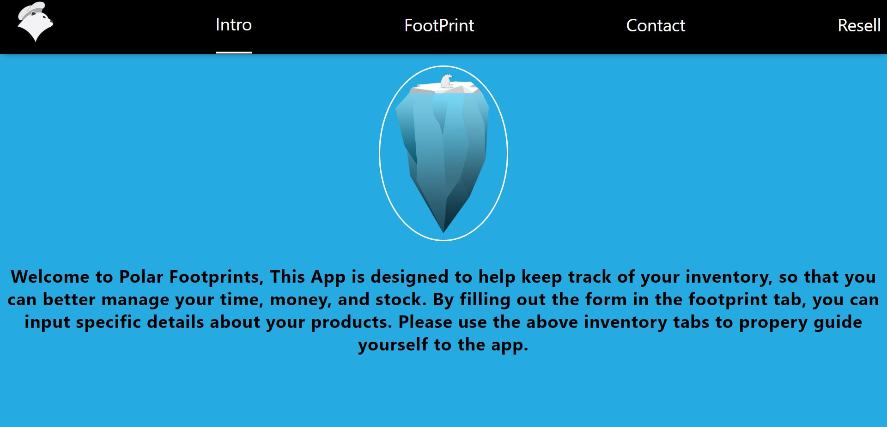
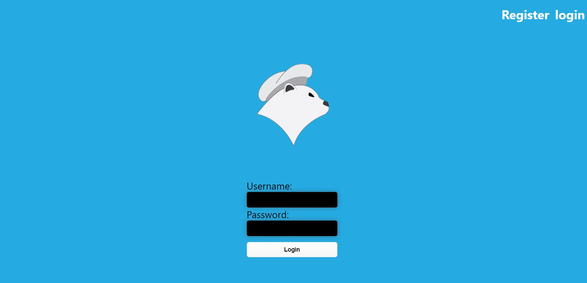

# Polar Footprints

An application that allows helps users keep track of inventory, so that you can better manage your time, money, and stock.

## Technologies

Polar Footprints was built using React and CSS

## API Repo

https://github.com/Joalvaca/Polar-Server.git

## Live Site

